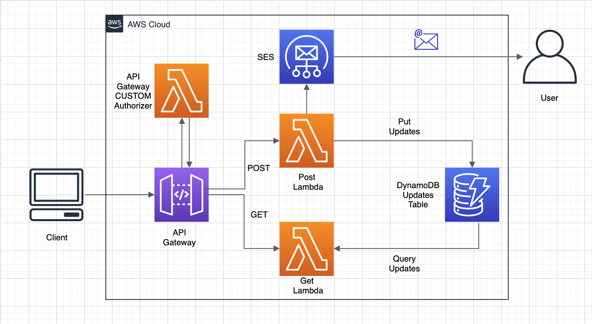
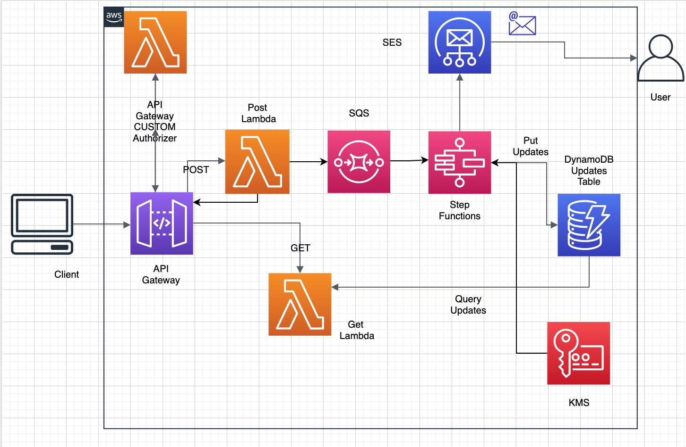

## What is it?
This service delivers an update to a user via email. This behaviour is tiggered via an API call

### Future scope of improvements:
These are some improvements that can be done to make this system more resilient and scalable: 

1. Introduce a proxy lambda between the POST lambda and API Gateway which puts the request payload onto a SQS and sends a response to the client. The POST lambda then consumes these payload from the SQS and does the task of sending email and persisting the event.
2. The POST lambda can be broken down into a Step Function. This ensures retry at any stage of the processing. For e.g. data loss situation like - the email is sent and the process breaks while persisting the data. This can be easily solved using a Step function.
3. Custom domain names on Route53
4. Provision encrypted secrets and decrypt dynamically using KMS
5. Implement rate limiting

### Some areas neglected assuming the focus to be CLoud Architecture

1. Unit tests
2. Use a better logger like Bunyan
3. Better error handling
4. Open-API Spec
